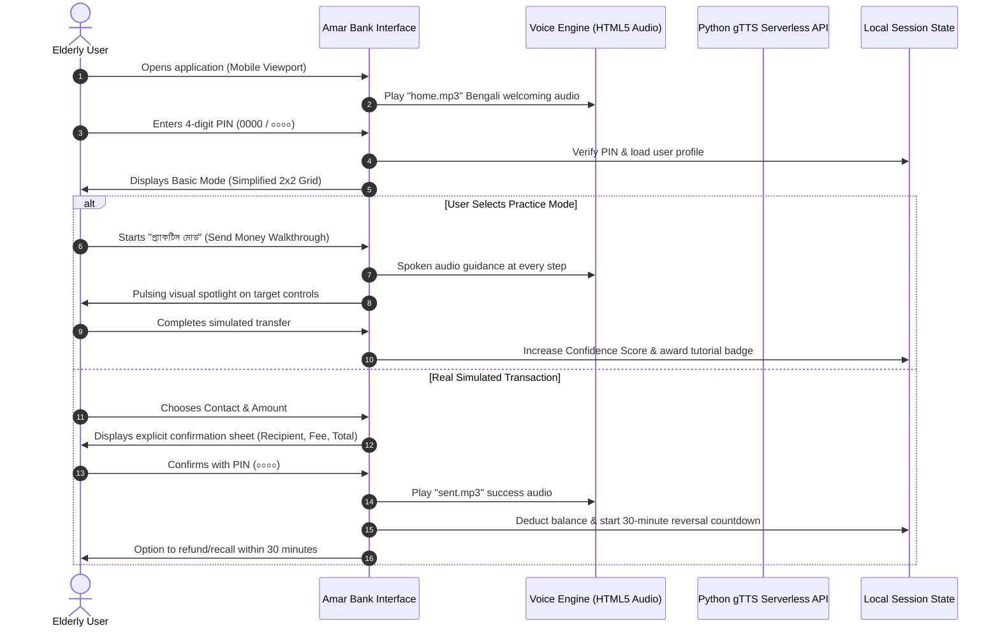

# Amar Bank (আমার ব্যাংক) — Inclusive Digital Banking Prototype for Elderly Users

An age-friendly, culturally adaptive mobile banking interface designed specifically to empower senior citizens and low-literacy users in Bangladesh and the Global South.

**Live App**: [আমার ব্যাংক](https://amarbank.vercel.app/)

> **Academic Project & Thesis**:  
> Developed for **CSE400: PROJECT & THESIS**, Department of Computer Science and Engineering, **BRAC University**.  
> Based on the undergraduate thesis: [_"Inclusive Design for Digital Banking Interfaces: Rethinking Interfaces and Design Processes for the Elderly Users in the Global South"_](Final_Paper.md).

<p align="left">
  
</p>

---

> [!IMPORTANT]
> **App Login PIN**: Enter **`0000`** (tap **`০`** four times on the Bengali numeric keypad) to unlock the app and authorize simulated transactions.
>
> **Mobile-First Experience**: This prototype is built specifically for mobile screens (`< 768px`). When testing on a desktop browser, open **Developer Tools** (`F12` or `Ctrl + Shift + M`) and switch to **Mobile Device Emulation** (e.g., iPhone 14, Pixel 7, or Galaxy S20).

---

## Screenshots

<p align="center">
  
  
</p>

---

## Background & Motivation

In Bangladesh, digital financial services (DFS) have grown exponentially. However, elderly citizens remain disproportionately excluded. Complex multi-layered menus, English jargon, rapid OTP expirations, small touch targets, and severe security anxiety create dependency on younger relatives or third-party agents, eroding financial independence.

This thesis was motivated by the tragic real-world toll of digital exclusion in Bangladesh—such as the incident where senior citizen Kabir Ahmed suffered a fatal cardiac arrest after waiting five agonizing hours in a bank queue under the scorching sun just to withdraw his quarterly pension.

_Amar Bank_ rethinks digital banking from the ground up through **Human-Centered Design (HCD)**, **Participatory Co-Design**, and **Accessibility Engineering** to provide an intuitive, forgiving, and trustworthy financial experience for elderly users.

---

## Key Features & Inclusive Innovations

- **Bangla-First Localization & Cultural Metaphors**  
  All interface labels, numeric digits (`০-৯`), icons, and instructions are rendered in native Bengali using readable typography ([Hind Siliguri](https://fonts.google.com/specimen/Hind+Siliguri), [Noto Serif Bengali](https://fonts.google.com/specimen/Noto+Serif+Bengali), and [Tiro Bangla](https://fonts.google.com/specimen/Tiro+Bangla)).

- **Fitts' Law Compliant Large Touch Targets**  
  Oversized interactive buttons, high visual contrast (deep forest green, soft gold, and clean neutral palettes), and generous tap spacing tailored for motor decline, tremors, and reduced eyesight.

- **Dual-Mode Interface (Basic / Senior vs. Regular)**
  - **Basic Mode (Default)**: A clean 2×2 grid displaying only essential daily functions (_Send Money_, _Receive Money_, _Pay Bills_, _Statement/Hishab_).
  - **Regular Mode**: Toggleable parallel view revealing extended services (savings, loans, cash-out) without alienating novices.

- **Forgiving Interactions & 30-Minute Transaction Grace Period**  
  To alleviate the paralyzing fear of accidental transfers, users have a **30-minute recall window** to reverse transactions directly from the transaction log.

- **Extended OTP Validity Window**  
  A relaxed **180-second OTP timer** (compared to standard 60-second industry timers) gives older adults adequate time to read, memorize, and input verification codes without panicking.

- **Integrated Bengali Voice Guidance**  
  Provides spoken auditory confirmation for key screens, transitions, and error states via pre-recorded natural audio (`voice/*.mp3`) and fallback dynamic Bengali Text-to-Speech (`/api/tts.py` powered by `gTTS`).

- **Gamified Learning & Risk-Free Practice Sandbox**
  - **Interactive Walkthrough**: Step-by-step onboarding with animated pulsing focal rings directing attention to active buttons.
  - **Practice Mode**: A completely safe simulated environment where users practice sending money with zero risk to their actual balance.
  - **Confidence Progression Bar**: A visual score metric that increases as users successfully complete tasks, building self-efficacy.
  - **Reward Milestones**: Congratulatory celebration modal and cashback badges upon achieving task completions.

- **Defensive Multi-Step Confirmation**  
  Explicit review sheets showing Recipient Name, Account Number, Amount, Transfer Charge (৳ ০), and Total before requesting PIN confirmation.

---

## How It Works



---

## Tech Stack

| Component            | Technology                                           | Purpose                                                           |
| :------------------- | :--------------------------------------------------- | :---------------------------------------------------------------- |
| **Frontend Core**    | HTML5, Modern JavaScript (ES6+)                      | Lightweight client-side application and state management          |
| **Styling & System** | CSS3 (Custom Variables, Keyframe Animations)         | High contrast, age-adaptive layout, mobile-first responsiveness   |
| **Typography**       | Google Fonts (`Hind Siliguri`, `Noto Serif Bengali`) | Optimized legibility for complex Bengali ligatures                |
| **Voice Guidance**   | HTML5 Audio (`voice/*.mp3`)                          | Instant, zero-latency localized audio playback                    |
| **Dynamic TTS**      | Python 3.10+, `gTTS`                                 | Serverless API handler generating on-the-fly Bengali speech       |
| **Deployment**       | Vercel / Static Web Server                           | Optimized for mobile web access with zero client-side build steps |

---

## Project Structure

```
BankAppPrototype/
├── api/
│   └── tts.py          # Python serverless function for dynamic Bengali TTS (gTTS)
├── voice/              # Pre-rendered Bengali audio prompts
│   ├── home.mp3        # Home screen welcoming audio
│   ├── send.mp3        # Send money guidance
│   ├── receive.mp3     # Receive/QR code guidance
│   ├── bill.mp3        # Utility bill payment guidance
│   ├── hishab.mp3      # Transaction history & statement guidance
│   ├── profile.mp3     # Profile & mode toggle guidance
│   ├── help.mp3        # Help & tutorial guidance
│   ├── contact.mp3     # Contact selection guidance
│   ├── sent.mp3        # Transaction success confirmation
│   └── back.mp3        # Reversal & refund confirmation
├── index.html          # Main single-page application markup
├── style.css           # Design tokens, accessibility styles & animations
├── script.js           # Client state, walkthrough logic, PIN verification & gamification
├── favicon.jpg         # Amar Bank brand icon
├── Final_Paper.md      # Full BRAC University undergraduate thesis paper
├── requirements.txt    # Python dependencies for TTS API (`gtts`)
├── .gitignore          # Version control ignore definitions
└── LICENSE             # MIT Open Source License
```

---

## Getting Started

### Prerequisites

- A modern web browser (Google Chrome, Mozilla Firefox, Microsoft Edge, or Safari).
- _(Optional)_ Python 3.10+ if you wish to run the dynamic TTS serverless API locally.

---

### Step 1 — Clone the Repository

```bash
git clone https://github.com/flowstxte/BankAppPrototype.git
cd BankAppPrototype
```

### Step 2 — Run Locally

Because this prototype is built using standard web technologies with no compilation steps required, you can run it immediately:

#### Option A: Using Python built-in HTTP server (Recommended)

```bash
python -m http.server 3000
```

Open your browser and navigate to:

```
http://localhost:3000
```

#### Option B: Using Node.js `serve`

```bash
npx serve .
```

#### Option C: VS Code Live Server

Right-click `index.html` in VS Code and select **"Open with Live Server"**.

---

### Step 3 — Switch to Mobile View (Important!)

_Amar Bank_ enforces a mobile viewport guard to simulate the physical smartphone environment:

1. In your desktop browser, press **`F12`** (or right-click and choose **Inspect**).
2. Click the **Toggle Device Toolbar** icon (or press **`Ctrl + Shift + M`** on Windows/Linux or **`Cmd + Shift + M`** on macOS).
3. Select any mobile preset (e.g. **iPhone 14**, **Pixel 7**, or **Samsung Galaxy S20**).
4. Refresh the page if needed.

---

### Step 4 — Log In to the App

- When the PIN screen appears, enter:
  ```
  0000
  ```
- Tap the Bengali zero digit (**`০`**) **4 times**.
- You will be greeted with the voice-assisted home dashboard!

---

### Step 5 — (Optional) Run the Dynamic TTS Service

If you want to test dynamic on-the-fly speech generation:

```bash
pip install -r requirements.txt
```

Deploying to [Vercel](https://vercel.com) automatically recognizes `api/tts.py` as a Python serverless function with zero additional configuration.

---

## Research Methodology & Empirical Findings

This prototype was iteratively designed, refined, and validated as part of the CSE400 research at BRAC University:

- **Sample Size**: 31 elderly participants across diverse socioeconomic, literacy, and geographic backgrounds in Bangladesh.
- **Methods**: Qualitative semi-structured interviews, field observations at bank branches, think-aloud usability testing, and co-design workshops.
- **Key Findings**:
  - **90% Satisfaction Rate**: 90% of participants expressed high satisfaction with the simplified Bengali-first layout over conventional commercial banking apps.
  - **Anxiety Reduction**: The zero-risk **Practice Mode** combined with the **30-Minute Transaction Recall** dramatically lowered the fear of making irreversible monetary mistakes.
  - **Audio Efficacy**: 100% of participants with visual impairments or declining acuity cited spoken Bengali feedback as vital for independent usage.

For full research details, statistical analyses, and policy recommendations, see [Final_Paper.md](Final_Paper.md).

---

## Thesis Team & Acknowledgements

### Student Researchers (BRAC University)

- **MD. Mohaimenul Haque Helali** (Student ID: 24341258)
- **Sahana Parvin Nupur** (Student ID: 24141251)
- **Ullas Sarkar Tirtha** (Student ID: 24141252)
- **Aarya Ibteda Foyez** (Student ID: 22201509)
- **Adnan Sami Srijon** (Student ID: 24141166)

### Supervisors & Committee

- **Supervisor**: Partha Bhoumik, Lecturer, Department of Computer Science and Engineering, BRAC University
- **Supervisor**: Anika Priodorshinee Mrittika, Lecturer, Department of Computer Science and Engineering, BRAC University
- **Thesis Coordinator**: Md. Golam Rabiul Alam, PhD, Professor, Department of CSE, BRAC University
- **Head of Department**: Dr. Sadia Hamid Kazi, PhD, Chairperson and Associate Professor, Department of CSE, BRAC University

We express our deepest gratitude to the 31 elderly participants who generously contributed their time and personal stories to make this study possible.

---

## License

This project is open-source under the [MIT License](LICENSE).
